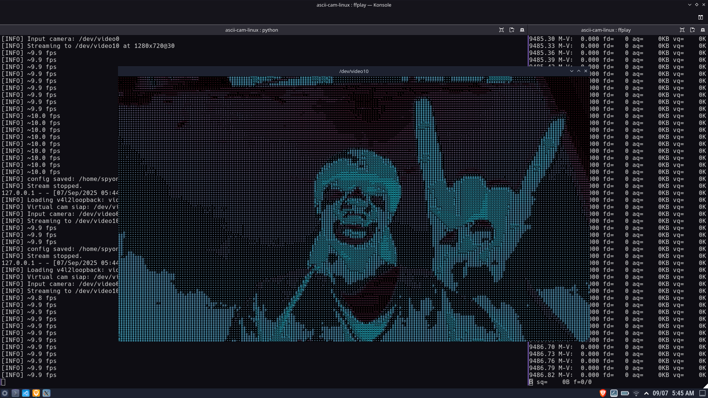

<div align="center">
  
</div>


# ASCII Virtual Cam (Duotone) by CHAT GPT

Script Python untuk mengubah input webcam menjadi **video ASCII berwarna (duotone)** dan mengalirkannya ke **virtual camera** via `v4l2loopback`. Script otomatis menjalankan:

```bash
sudo modprobe -r v4l2loopback 2>/dev/null || true
sudo modprobe v4l2loopback devices=1 video_nr=10 exclusive_caps=1 card_label="ASCII Cam"
```

saat start (kecuali Anda pakai `--skip-loopback`).

---

## 1) Sistem yang Didukung

* Linux (Ubuntu/Debian/Arch/…)
* Kernel mendukung module `v4l2loopback`
* Python 3.9–3.12

> macOS/Windows tidak didukung karena `v4l2loopback` spesifik Linux.

---

## 2) Dependensi

### Paket OS (wajib)

* `kmod` (untuk `modprobe`) — biasanya sudah ada
* `v4l2loopback-dkms` (Ubuntu/Debian) atau `v4l2loopback-dkms`/`v4l2loopback` (Arch)

**Ubuntu/Debian:**

```bash
sudo apt update
sudo apt install -y v4l2loopback-dkms v4l2loopback-utils python3-venv python3-dev build-essential
```

**Arch/Manjaro:**

```bash
sudo pacman -Syu --needed v4l2loopback-dkms
```

> Jika `v4l2loopback` belum terpasang, pasang dulu dan reboot bila diminta.

### Paket Python (wajib)

* `opencv-python`
* `numpy`
* `pyvirtualcam`

**Opsional** (debugging/video tools):

* `v4l2loopback-utils`, `v4l2-ctl`, `ffmpeg`

---

## 3) Instalasi (direkomendasikan pakai virtualenv)

```bash
# 1) clone / salin script 'cam.py' ke folder kerja
cd /path/ke/proyek

# 2) buat virtualenv
python3 -m venv .venv
source .venv/bin/activate

# 3) install dependensi python
pip install --upgrade pip
pip install opencv-python numpy pyvirtualcam
```

> Jika `opencv-python` gagal build, coba:
>
> * `sudo apt install python3-opencv` lalu `pip install pyvirtualcam numpy`
> * atau gunakan `pip install opencv-python-headless` (tanpa GUI)

---

## 4) Cara Menjalankan

Pastikan **script** bernama `cam.py` berada di folder kerja.

### Mode interaktif (ada menu resolusi/FPS/grid)

```bash
source .venv/bin/activate
python3 cam.py --menu
```

### Mode non-interaktif (langsung pakai argumen)

```bash
source .venv/bin/activate
python3 cam.py \
  --out-device /dev/video10 \
  --width 1280 --height 720 --fps 30 \
  --cols 160 --rows 80 --mirror \
  --duotone "#00ffff" "#ff00ff" --bg "#000000"
```

### Opsi penting

* `--menu` : tampilkan menu preset & input kustom resolusi/FPS/grid.
* `--out-device /dev/videoN` : target virtual cam (default `/dev/video10`).
* `--video-nr N` : nomor device saat *modprobe*. Otomatis disinkronkan dengan `--out-device` bila diisi.
* `--skip-loopback` : **jangan** jalankan `modprobe`, gunakan device existing.
* `--mirror` : mirror horizontal input.
* `--duotone "#RRGGBB" "#RRGGBB"` : warna gradasi karakter (gelap → terang).
* `--bg "#RRGGBB"` atau `--bg "none"` : warna latar.

**Catatan**
Saat start, script akan:

1. `modprobe -r v4l2loopback`
2. `modprobe v4l2loopback devices=1 video_nr=<nr> exclusive_caps=1 card_label="ASCII Cam"`
3. Mencari input camera otomatis (atau gunakan `--in-index` untuk paksa).
4. Membuka virtual camera (`/dev/video<nr>`) dan mulai streaming.

---

## 5) Menggunakan di Aplikasi Lain

Buka aplikasi (Zoom/Meet/OBS/Telegram/Discord), lalu pilih kamera bernama **“ASCII Cam”** atau pilih device `/dev/video10` sebagai sumber video.

> Di Wayland, beberapa aplikasi butuh izin screen/camera tambahan. Jika tidak muncul, coba jalankan dari X11 session atau gunakan OBS + V4L2 sink.

---

## 6) Contoh Penggunaan Tambahan

* Output 640×480\@15, grid 100×50, tanpa mirror:

  ```bash
  python3 cam.py --out-device /dev/video10 --width 640 --height 480 --fps 15 --cols 100 --rows 50
  ```

* Pakai warna duotone pink → biru, latar gelap:

  ```bash
  python3 cam.py --duotone "#ff00aa" "#00aaff" --bg "#000000"
  ```

* Pakai input kamera tertentu (mis. `/dev/video2`):

  ```bash
  python3 cam.py --in-index 2 --menu
  ```

* Skip auto-modprobe (jika sistem sudah mengatur sendiri):

  ```bash
  python3 cam.py --skip-loopback --out-device /dev/video10 --menu
  ```

---

## 7) Troubleshooting

### “Device /dev/video10 is not a video output device”

Artinya `v4l2loopback` tidak diberi `exclusive_caps=1` saat load. Solusi:

```bash
# tutup semua app yang memakai /dev/video10 dulu
sudo modprobe -r v4l2loopback 2>/dev/null || true
sudo modprobe v4l2loopback devices=1 video_nr=10 exclusive_caps=1 card_label="ASCII Cam"
```

Lalu jalankan ulang:

```bash
python3 cam.py --out-device /dev/video10
```

### “No camera opened”

Kamera fisik dipakai app lain atau diblok aksesnya.

* Tutup aplikasi lain (browser/Zoom).
* Coba pakai `--in-index N` (N = 0,1,2…).
* Cek daftar device:

  ```bash
  v4l2-ctl --list-devices
  ```

### “Permission denied / sudo tidak ada”

Script butuh hak akses untuk `modprobe`. Opsi:

* Jalankan `python3 cam.py` dengan `sudo` (tidak disarankan untuk harian).
* Atau izinkan `modprobe v4l2loopback` tanpa password (opsional, **pahami risikonya**):

  ```bash
  sudo visudo
  # Tambahkan baris (ganti USER jadi nama user Anda):
  USER ALL=(ALL) NOPASSWD: /sbin/modprobe v4l2loopback, /sbin/modprobe -r v4l2loopback
  ```

  Setelah itu, jalankan script normal (tanpa `sudo`).

### “modprobe: command not found”

Pasang `kmod` (di Ubuntu/Debian lazimnya sudah ada).

```bash
sudo apt install -y kmod
```

### Device tidak muncul / berbeda nomor

Beberapa distro/udev bisa menomori ulang device. Gunakan `--out-device /dev/videoN` sesuai hasil:

```bash
v4l2-ctl --list-devices
ls -l /dev/video*
```

sesuaikan dengan argumen script.

---

## 8) Menjalankan saat Boot (opsional)

Jika ingin auto-start setelah login/boot, gunakan **systemd user service**:

```bash
mkdir -p ~/.config/systemd/user
tee ~/.config/systemd/user/ascii-cam.service >/dev/null <<'EOF'
[Unit]
Description=ASCII Virtual Camera (User)
After=default.target

[Service]
Type=simple
WorkingDirectory=%h/path/ke/proyek
ExecStart=%h/path/ke/proyek/.venv/bin/python %h/path/ke/proyek/cam.py --out-device /dev/video10 --width 1280 --height 720 --fps 30 --cols 160 --rows 80
Restart=on-failure
RestartSec=3

[Install]
WantedBy=default.target
EOF

systemctl --user daemon-reload
systemctl --user enable --now ascii-cam.service
```

> Jika butuh `modprobe`, lebih aman pakai **systemd system service** + `Environment=...`/`ExecStartPre` dengan hak root. (README ini fokus ke jalankan manual.)

---

## 9) Uninstall / Reset

Hentikan script & unload module:

```bash
pkill -f "python3 cam.py" || true
sudo modprobe -r v4l2loopback
```

Hapus virtualenv:

```bash
deactivate 2>/dev/null || true
rm -rf .venv
```

---

## 10) Lisensi

Gunakan bebas untuk keperluan Anda. Atribusi ke pembuat tidak wajib tapi dihargai.

---

## 11) Ringkasan Cepat

```bash
# Install paket OS
sudo apt install -y v4l2loopback-dkms v4l2loopback-utils python3-venv

# Setup venv & deps
python3 -m venv .venv
source .venv/bin/activate
pip install opencv-python numpy pyvirtualcam

# Jalankan (menu interaktif)
python3 cam.py --menu

# Jalankan (langsung)
python3 cam.py --out-device /dev/video10 --width 1280 --height 720 --fps 30 --cols 160 --rows 80 --mirror
```

Kalau ada error spesifik, lemparkan log/traceback-nya—nanti gue bantu bedah cepat.
